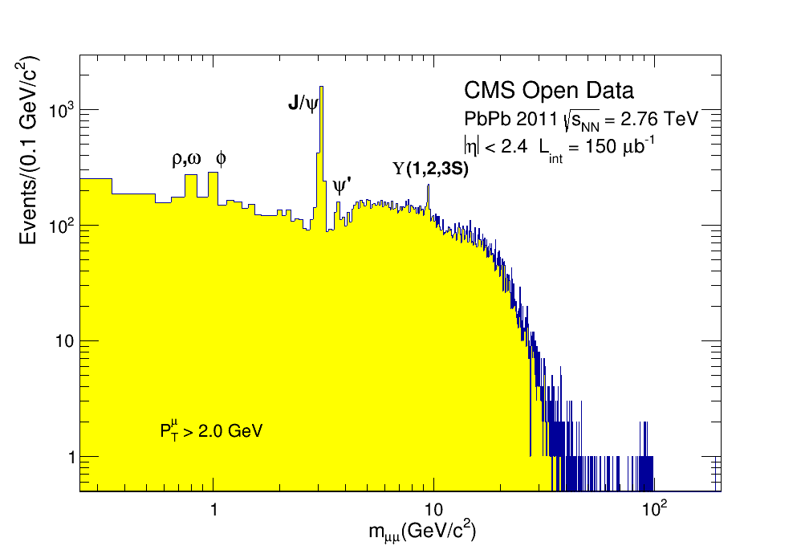
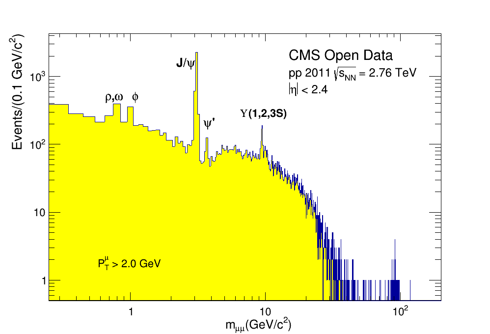

# HiForestProducerTool

This repository hosts a collection of simple examples that use CMSSW EDAnalyzers to extract trigger information and generate a ROOT file named HiForest from public data of heavy-ion and proton-proton collisions collected by CMS in the year 2011. Here, you will find instructions on how to run these codes and replicate the analysis of the two-muon spectrum.

## Instructions:

### Preparing the Container:

To perform this analysis, we will use the [Docker container](https://docs.docker.com/engine/install/). To do this, download Docker as indicated in the previous link. After the download, copy and paste the following command into your computer's terminal:

  ```
  docker run --name hi2011_od -it  gitlab-registry.cern.ch/cms-cloud/cmssw-docker/cmssw_4_4_7-slc5_amd64_gcc434:latest /bin/bash
  ```

After downloading the container, follow these steps:

- Create a directory and obtain the code using git:
  ```
  mkdir HiForest
  cd HiForest
  git clone -b 2011 https://github.com/thiagorangel45/HIOpenDataAnalysis.git HiForestProducer
  cd HiForestProducer
  ```
  
- Compile the files:

  ```
  scram b
  ```
  
### Running the configuration file.

- in this configuration file, it is set to run only `100` events of PbPb collisions, as a check to ensure the code is running correctly. If there are no error outputs and the ROOT output file is generated correctly, change from `100` to `-1` to run all events from the input file.
  
- Execute the configuration file as follows:

  ```
  cmsRun hiforestanalyzer_cfg.py
  ```

The configuration file is set to read the input ROOT files from the list `CMS_HIRun2011_HIDiMuon_RECO_04Mar2013-v1_root_file_index.txt`.

An output file named `HiForestAOD_DATAtest.root` will be produced.

NOTE: The first time you run the file, it may take a while (depending on the speed of your connection) to the point that it seems like nothing is happening. But everything is fine. It might be necessary to "split" the input file into smaller files and run them one by one. In this case, always change the name of the output file; otherwise, it will overwrite the previous file.

To merge all these output files into one, execute the following code within the CMSSW container:

```
hadd nome_do_arquivo_final arquivo_1 arquivo_2 ....
```
In the end, a new file named nome_do_arquivo_final (change it to any name you prefer) should be created.

You can also modify the file [src/Analyzer.cc](src/Analyzer.cc) to include other objects such as tracks, electrons, etc., in the hiforest output file. Instructions for this are provided within the file itself.


### Running the analysis:

The file [forest2dimuon.C](forest2dimuon/forest2dimuon.C) is a script for analyzing the output file. It applies a trigger "filter" and conducts a basic selection analysis, producing histograms of invariant mass. In the [forest2dimuon](forest2dimuon) folder, you can observe some modifications to the original file and the generated plots, one of this modifications is named forest2dimuon_2011PbPb_mass.C.

To run this file, you will need ROOT installed. With ROOT installed, execute the program as follows:
```
root -l forest2dimuon_2011PbPb_mass.C
```

<p align="center">
  
</p>


You can select other triggers for your analysis by accessing the ROOT file using `TBrowser b` in ROOT and checking the Trigger Tree. 

### Running the analysis for the proton-proton dataset:

To run events from reference proton-proton collisions, you only need to change the input files, the JSON file, and replace `datasetName = cms.string("HIDiMuon")` in the hiforestanalyzer.py file with `datasetName = cms.string("AllPhysics2760")` and following all those steps again and running the file for the proton-proton like this:

```
root -l forest2dimuon_2011pp_mass.C
```

You will produce this plot:

<p align="center">
  
</p>

